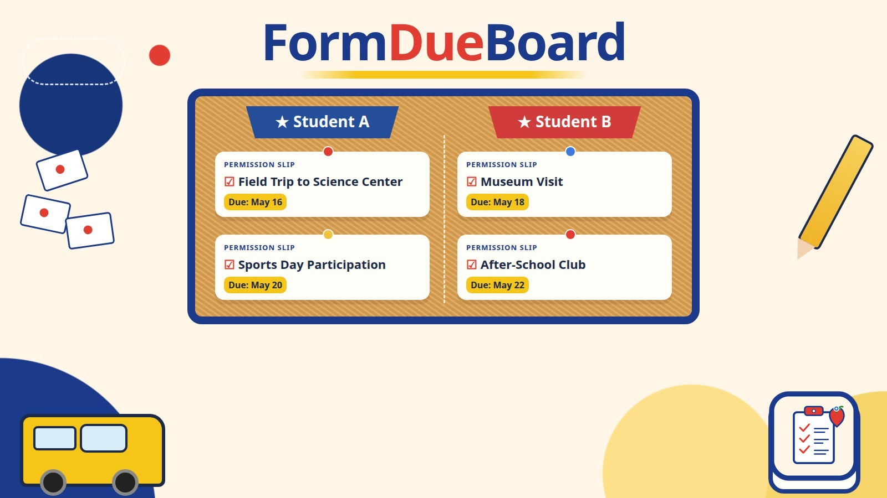

# FormDueBoard



Permission slips, field trips, sign-and-return forms, fees, and picture day, pulled out of school email into one checklist per kid.

## Quick start

1. Download or clone this repository.
2. Double-click the launcher:
   - Mac: `Launch FormDueBoard.command`
   - Windows: `Launch FormDueBoard.bat`
   - Linux: `./launch.sh`, or open `formdueboard.desktop`
3. The first launch creates a `.venv`, installs the pinned dependencies, and opens the board in your browser. Later launches start straight away.
4. Drop `.eml` files or an `.mbox` export into `data/inbox`, then click **Scan inbox**. You can also use **Add email files** in the board.

Python 3.11 or newer is required. If Python is missing or too old, the launcher says so and links to https://www.python.org/downloads/.

The board listens only on `127.0.0.1`. There is no account and no cloud service.

## What it does

Each kid gets a column. A card shows the form, the due date, a snippet of the source email (and a Gmail link when the message was fetched that way), any attachment name, and a status of to do, signed, or returned. **Mark done** sets the status to returned. Due-soon and overdue cards are highlighted. Cancelled trips stay on the board but drop out of the calendar export.

**Export .ics** writes an America/New_York calendar with a reminder two days before each open due date. **Print checklist** opens a printable page.

Extraction is rules and patterns, with a confidence score. It does not call a language model. It looks for form words, due dates (including "by Friday" and "tomorrow", counted from the email's own date), event dates kept separate from due dates, and dollar amounts. A message from a configured teacher is filed under that teacher's student unless the text names another kid, a nickname, or the other kid's grade. If the kid is ambiguous, or the note is too thin to trust, it goes to **Needs a look** and is not filed until you choose a kid. Replies and forwards of the same form collapse into one card. A later "extended to …" or "cancelled" note updates that card.

## Dev setup

```bash
python3 -m venv .venv
source .venv/bin/activate
pip install -r requirements.txt -r requirements-dev.txt
python -m formdueboard --no-browser
```

`FORMDUEBOARD_NO_BROWSER=1` also skips opening a browser. Other commands:

```bash
python -m formdueboard scan
python -m formdueboard load-samples
python -m formdueboard export-ics -o forms.ics
python -m formdueboard gmail-fetch
```

Copy `config.example.yaml` is written to `data/config.yaml` on first launch. Edit the kid nicknames, grades, and teachers there. `data/` is gitignored.

## Tests

```bash
pip install -r requirements.txt -r requirements-dev.txt
ruff check .
ruff format --check .
pytest
```

Fixtures are synthetic: Student A, Student B, fictional teachers, and `@example.com` only. A test fails if a source or fixture file contains an email address on any other domain.

## Privacy

- Mail and the SQLite database stay in the gitignored `data/` folder.
- The optional Gmail fetcher is **off** unless `gmail.enabled` is true.
- It uses your own OAuth client JSON at `data/gmail_client_secret.json` (also gitignored) and the `gmail.readonly` scope only.
- The search query is configurable. The default looks for form words in recent mail.
- The fetcher downloads raw messages. It does not send, label, modify, or delete anything in Gmail.
- Install the extra libraries only if you want that button: `pip install -r requirements-gmail.txt`.

## Optional packaged build

`scripts/build_app.py` runs PyInstaller.

- On a Mac it produces `dist/FormDueBoard.app` with `assets/icon.icns`.
- On Windows it produces `dist/FormDueBoard.exe` with `assets/icon.ico`.
- On Linux it produces a one-folder build. A hosted CI run only needs the test workflow; it does not have to package the app.

```bash
pip install pyinstaller
python scripts/build_app.py
```

Build the Mac app on a Mac and the Windows exe on Windows so the bundle matches that system.

## Limitations

- English school-mail phrasing only. Unusual wording can miss a form or land in Needs a look.
- Numeric dates are read as month/day/year.
- Email dates without a timezone are treated as UTC. This keeps mixed `.eml` and mbox exports sortable; add a timezone to exported mail when its local calendar day matters.
- "by Friday" means the next time that weekday occurs, including today. "next Friday" means the same thing unless the email was sent on Friday, in which case it means a week later.
- PDF text is extracted with pypdf. Scanned pages without a text layer are not read (no OCR). DOCX text is extracted; pictures inside a DOCX are not.
- One clear form per message is filed. A single email that requests two unrelated forms for the same kid may keep only the stronger one.
- Gmail OAuth was not exercised against a live Google account in development.
- The Mac `.command` launcher and the Windows `.bat` launcher were not run on those systems here. The Linux launcher can be syntax-checked with `bash -n`.
- PyInstaller packaging was not run in CI.
